# Pre-Requisites
- Neo4j 4.x installed

# Setting up an LDAP server for development/testing using Apache Directory Studio

In this section, we will describe how to setup an LDAP server using Apache Directory Studio to test the LDAP authentication in Neo4j (4.3.8).

First, we will setup the LDAP server using Apache Directory Studio, then finally login to Neo4j with the users setup in the LDAP server.


## Configure LDAP authentication in Neo4j

We will first configure LDAP authentication in Neo4j. In your Neo4j installation, go to NEO4J_HOME/conf/neo4j.conf and modify the following lines. Stop and restart Neo4j after making your changes.

```properties
#----------------------------------
# LDAP Authorization Configuration
#----------------------------------
# Authorization is performed by searching the directory for the groups that
# the user is a member of, and then map those groups to Neo4j roles.

# Perform LDAP search for authorization info using a system account instead of the user's own account.
#
# If this is set to `false` (default), the search for group membership will be performed
# directly after authentication using the LDAP context bound with the user's own account.
# The mapped roles will be cached for the duration of `dbms.security.auth_cache_ttl`,
# and then expire, requiring re-authentication. To avoid frequently having to re-authenticate
# sessions you may want to set a relatively long auth cache expiration time together with this option.
# NOTE: This option will only work if the users are permitted to search for their
# own group membership attributes in the directory.
#
# If this is set to `true`, the search will be performed using a special system account user
# with read access to all the users in the directory.
# You need to specify the username and password using the settings
# `dbms.security.ldap.authorization.system_username` and
# `dbms.security.ldap.authorization.system_password` with this option.
# Note that this account only needs read access to the relevant parts of the LDAP directory
# and does not need to have access rights to Neo4j, or any other systems.
#dbms.security.ldap.authorization.use_system_account=false

# An LDAP system account username to use for authorization searches when
# `dbms.security.ldap.authorization.use_system_account` is `true`.
# Note that the `dbms.security.ldap.authentication.user_dn_template` will not be applied to this username,
# so you may have to specify a full DN.
#dbms.security.ldap.authorization.system_username=

# An LDAP system account password to use for authorization searches when
# `dbms.security.ldap.authorization.use_system_account` is `true`.
#dbms.security.ldap.authorization.system_password=

# The name of the base object or named context to search for user objects when LDAP authorization is enabled.
# A common case is that this matches the last part of `dbms.security.ldap.authentication.user_dn_template`.
dbms.security.ldap.authorization.user_search_base=ou=Users,dc=example,dc=com

# The LDAP search filter to search for a user principal when LDAP authorization is
# enabled. The filter should contain the placeholder token {0} which will be substituted for the
# user principal.
dbms.security.ldap.authorization.user_search_filter=(&(objectClass=*)(uid={0}))

# A list of attribute names on a user object that contains groups to be used for mapping to roles
# when LDAP authorization is enabled.
#dbms.security.ldap.authorization.group_membership_attributes=memberOf

# An authorization mapping from LDAP group names to Neo4j role names.
# The map should be formatted as a semicolon separated list of key-value pairs, where the
# key is the LDAP group name and the value is a comma separated list of corresponding role names.
# For example: group1=role1;group2=role2;group3=role3,role4,role5
#
# You could also use whitespaces and quotes around group names to make this mapping more readable,
# for example: dbms.security.ldap.authorization.group_to_role_mapping=\
#          "cn=Neo4j Read Only,cn=users,dc=example,dc=com"      = reader;    \
#          "cn=Neo4j Read-Write,cn=users,dc=example,dc=com"     = publisher; \
#          "cn=Neo4j Schema Manager,cn=users,dc=example,dc=com" = architect; \
#          "cn=Neo4j Administrator,cn=users,dc=example,dc=com"  = admin
dbms.security.ldap.authorization.group_to_role_mapping=\
"cn=Users,dc=example,dc=com"      = reader

#END OF FILE
```

For more information on configuring LDAP authentication in Neo4j, please follow the guide here: //add doc link

## Install Apache Directory Studio
Download and install Apache Directory Studio from here: http://directory.apache.org/studio/

## Setup the LDAP server
We will first create our LDAP server. Launch your Apache Directory Studio application. Notice the tabs on the lower left hand corner. Click on the LDAP Servers tab. To create the server, click on the New Server icon, the first icon to the right of the LDAP Servers tab.

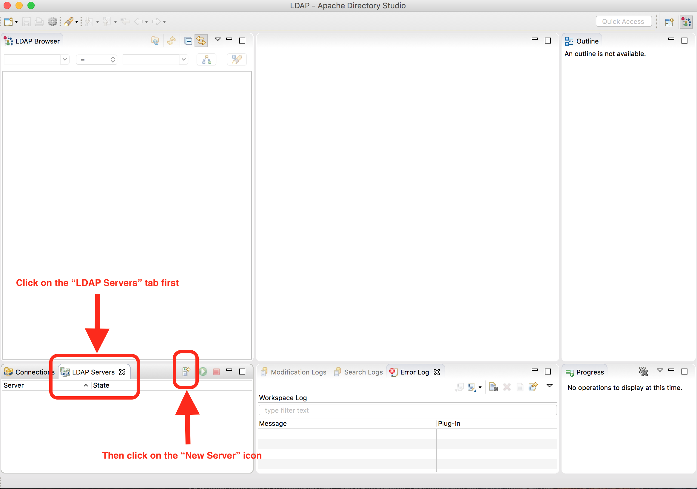

A dialog to create the server will appear, go the the Select the server type: section of the dialog. For our example, select ApacheDS 2.0.0 then click on the Finish button.

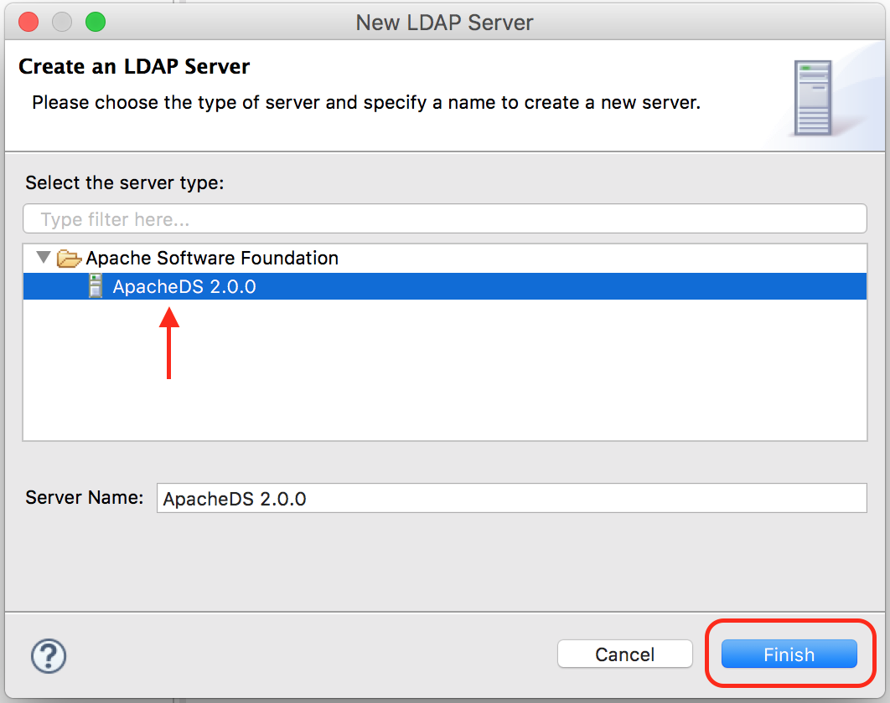

Next we’ll start our LDAP server. Click on the LDAP server we just created, ApacheDS 2.0.0, which will be displaying the status Stopped. To start the server, click on the green button right next to the tabs:

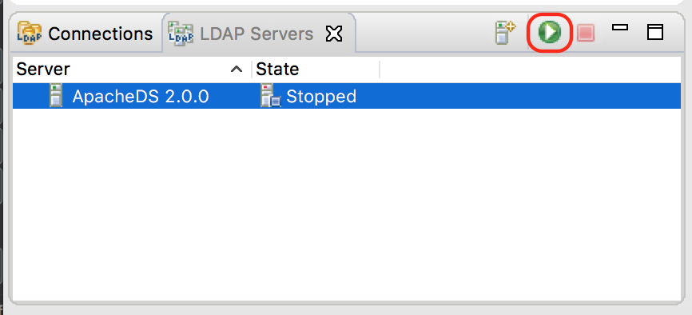

We’ll now need to connect the LDAP browser to our newly created LDAP server. To connect to the server, in the LDAP Server tab, right click on the server ApacheDS 2.0.0, then select Create a Connection

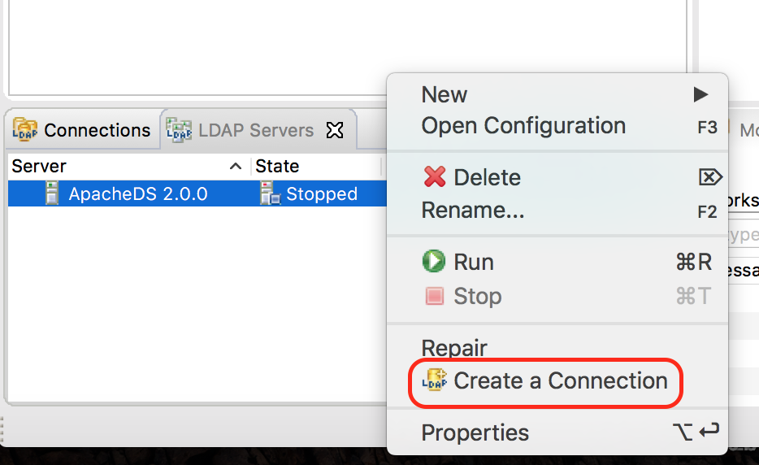

Click on the Connections tab, you should now see ApacheDS 2.0.0 listed.

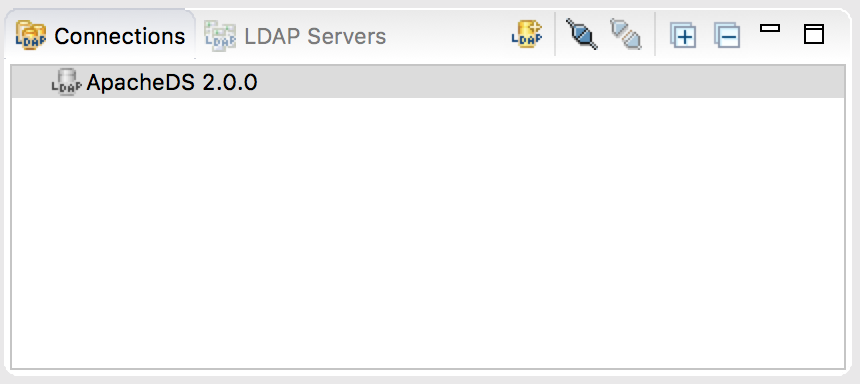

## Load some data into the LDAP Server

The server we setup earlier does not have any data yet. We will now load some data by using the LDIF editor. LDIF or LDAP Data Interchange Format, is a text format for representing LDAP data and commands. To open an LDIF editor, click on the New icon at the top left, or click File -> New, a dialog will appear with a list, select LDIF File under LDAP Browser


An empty file in the middle of your ApacheDS will appear. This is the LDIF editor. We will now enter some data into it to create users that Neo4j can authenticate through the LDAP Server we just setup. We will add three users, each belonging to a different groups for Neo4j. Please make sure that the attributes listed in the Neo4j LDAP configuration is configured in the LDAP server for each user. Copy and paste the data listed below into the LDIF editor. Make sure that there is an empty line after the last entry.

```ldif
dn: dc=example,dc=com
objectClass: domain
objectClass: top
dc: example

dn: ou=Users,dc=example,dc=com
objectClass: organizationalUnit
objectClass: top
ou: Users

dn: ou=Groups,dc=example,dc=com
objectClass: organizationalUnit
objectClass: top
ou: Groups

dn: cn=Joe Bloggs,ou=Users,dc=example,dc=com
objectClass: inetOrgPerson
objectClass: organizationalPerson
objectClass: person
objectClass: top
cn: Joe Bloggs
sn: Bloggs
ou: site_author
description: 19650324000000Z
employeeNumber: 9
givenName: Joe
mail: joe@example.com
telephoneNumber: 169-637-3314
telephoneNumber: 907-547-9114
uid: jbloggs
userPassword:: abc

dn: cn=Jane Doe,ou=Users,dc=example,dc=com
objectClass: inetOrgPerson
objectClass: organizationalPerson
objectClass: person
objectClass: top
cn: Jane Doe
sn: Doe
ou: site_admin
description: 19650324000000Z
employeeNumber: 12
givenName: Jane
mail: jane@example.com
telephoneNumber: 169-637-3314
telephoneNumber: 907-547-9114
uid: jdoe
userPassword:: abc

dn: cn=John Wick,ou=Users,dc=example,dc=com
objectClass: inetOrgPerson
objectClass: organizationalPerson
objectClass: person
objectClass: top
cn: John Wick
sn: Wick
ou: site_reviewer
description: 19650324000000Z
employeeNumber: 8
givenName: John
mail: john@example.com
telephoneNumber: 169-637-3314
telephoneNumber: 907-547-9114
uid: jwick
userPassword:: abc
```

Please note that a user can belong to multiple groups. To add another groupName value in the ldif file, just add another line specifying the attribute and the value. Notice the multiple values for the attribute ou (groupName)

```ldif
dn: cn=John Wick,ou=Users,dc=example,dc=com
objectClass: inetOrgPerson
objectClass: organizationalPerson
objectClass: person
objectClass: top
cn: John Wick
sn: Wick
ou: site_publisher
ou: site_editor
description: 19650324000000Z
employeeNumber: 8
givenName: John
mail: john@example.com
telephoneNumber: 169-637-3314
telephoneNumber: 907-547-9114
uid: jwick
userPassword:: abc
```

To add the data we entered in the LDIF file into the LDAP Server, first, click on the Browse button in the LDIF editor and select the connection we setup (ApacheDS 2.0.0), then click on the green (Execute LDIF) button next to the Browse button to get our data into the server.

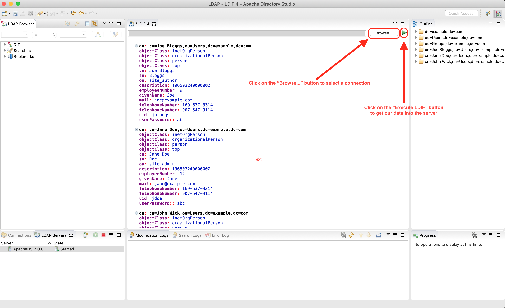

After executing the LDIF file, you should see the results in the Modification Logs tab at the bottom of the LDIF Editor and should look something like the image below:

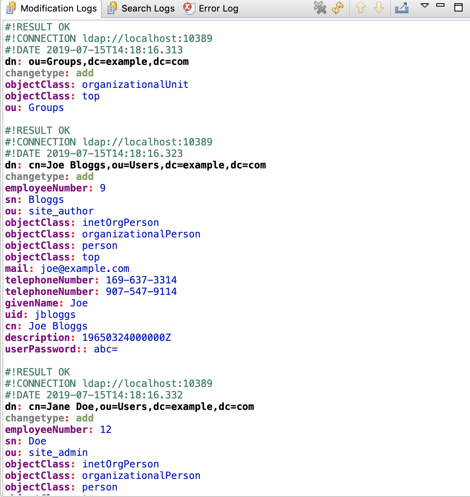

We should also be able to see the three users we just added in the LDAP browser

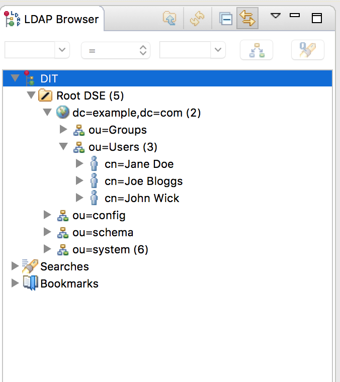

## Changing a user’s password in the LDAP server

Notice that we set the password to the same characters for all the users. Let’s change the password for all the users. To do this, from the LDAP Browser tab, navigate to DIT -> Root DSE -> dc=example,dc=com -> ou=Users, then click on the name os a user. We’ll click on user Jane Doe. A new tab will open in the middle of your ApacheDS with all the attributes for user Jane Doe. Double click on userPassword to change the user’s password.

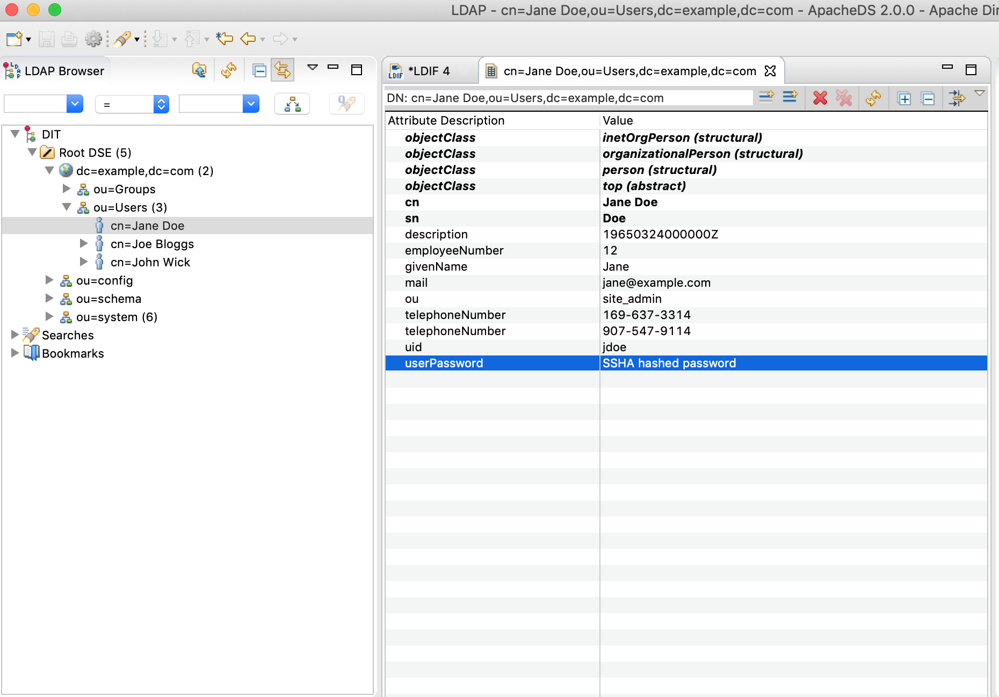

The Password Editor dialog will now be in focus. Click on New Password at the middle top and fill in the Enter New Password and Confirm New Password fields in the form, then click on the OK button

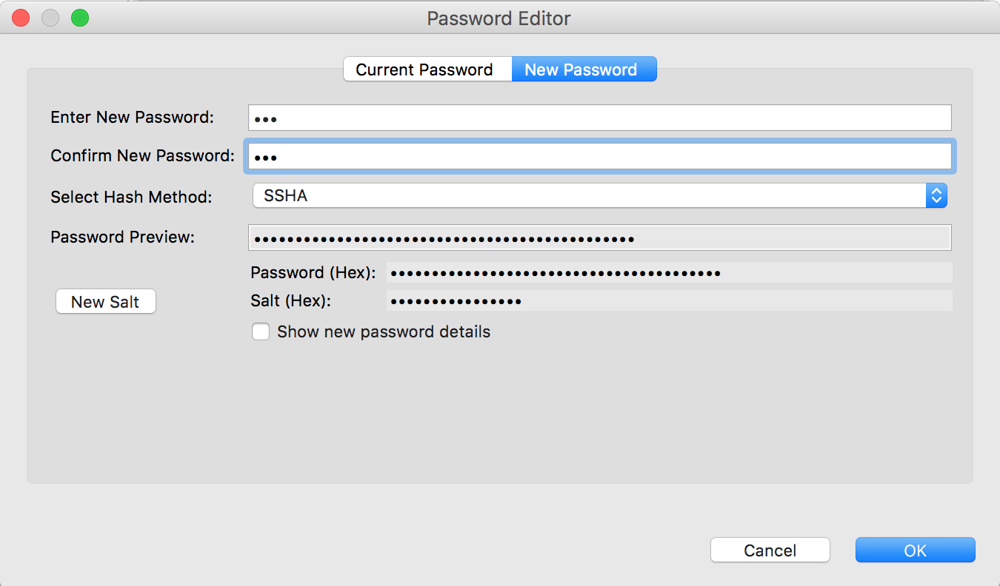

To test the new password you just entered, double click on userPassword attribute of the user, then click on Current Password in the Password Editor dialog. Enter the new password in the Verify Password field, then click on the Verify button.

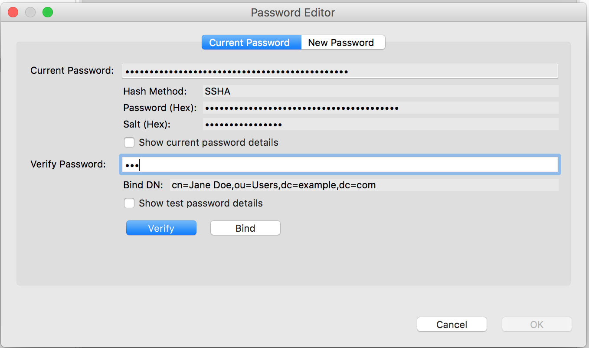

When successful, a dialog will appear that the password was verified successfully

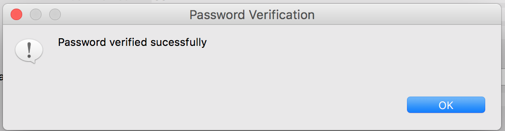

Repeat the steps listed above for the rest of the users we added in to the LDAP server to change their password. After changing all the user’s passwords, we can now try to login to Neo4j using the credentials of the users we just added.

## Logging in to Neo4j as an LDAP user

In your browser, enter http://localhost:7474/browser. Fill in the the username and password using one of the users we setup in the LDAP server. In the image below, we will log in the user jbloggs. If authentication is successful, the user should be taken to the you will see a success message.

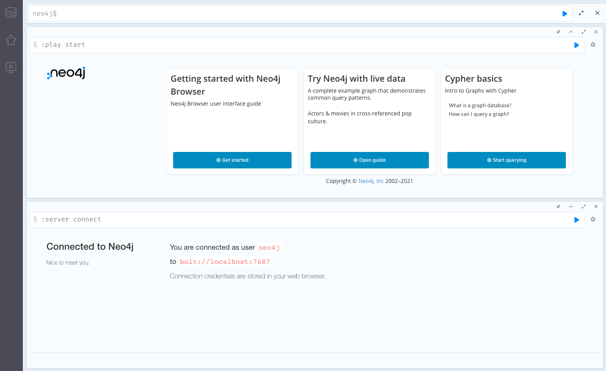
